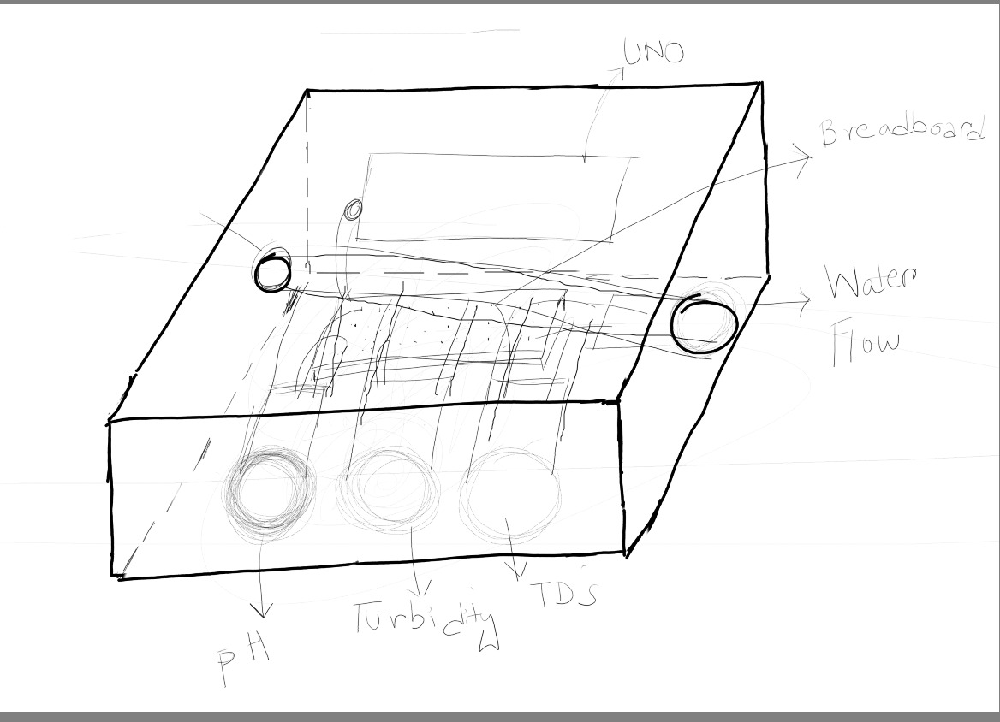
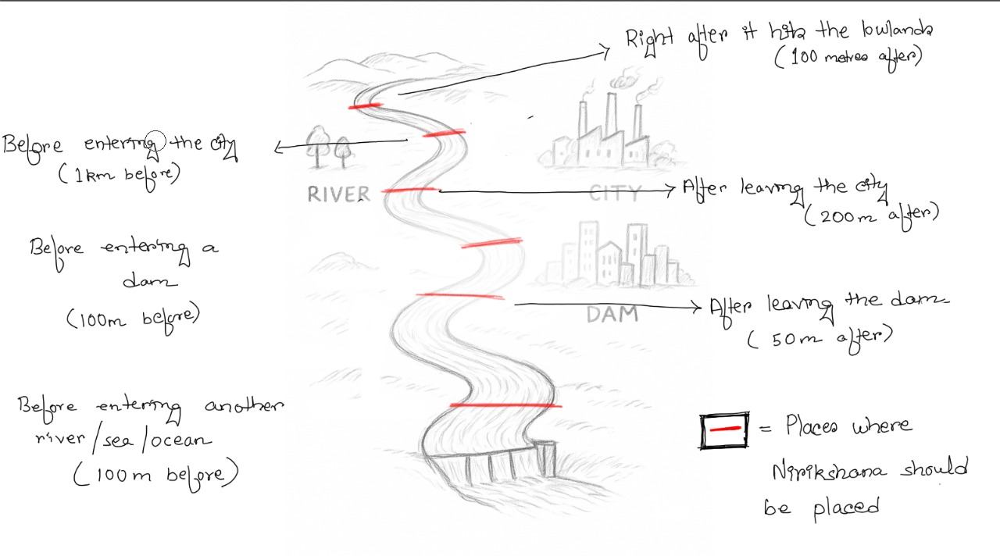
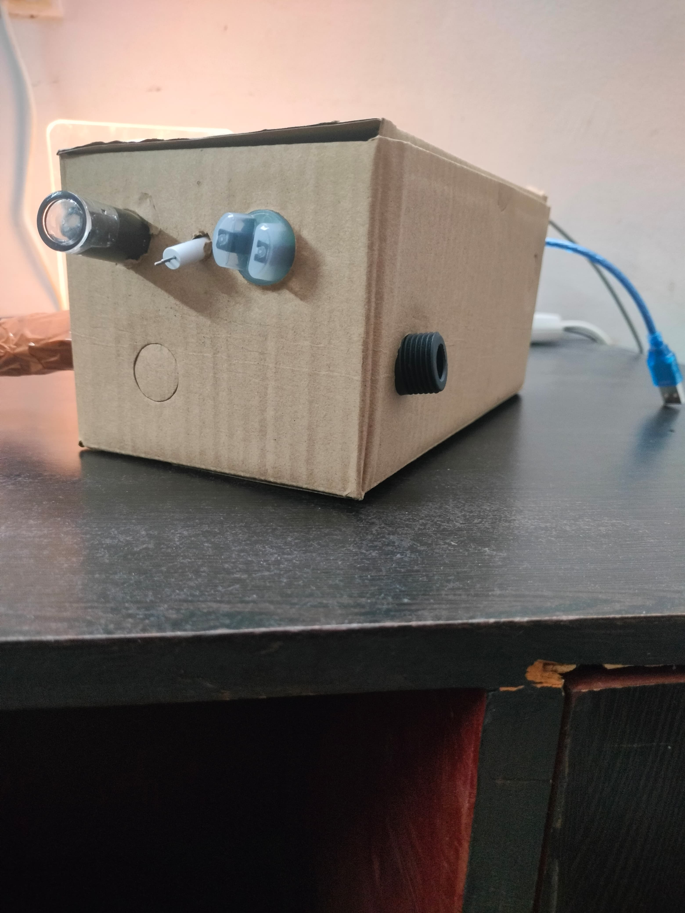
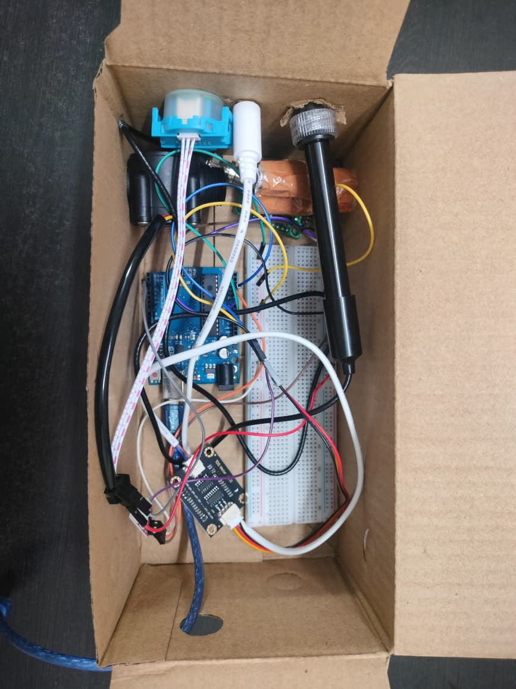
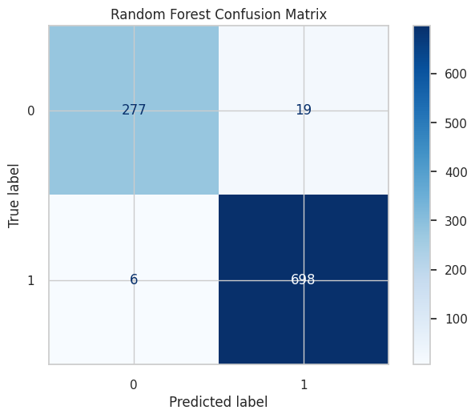
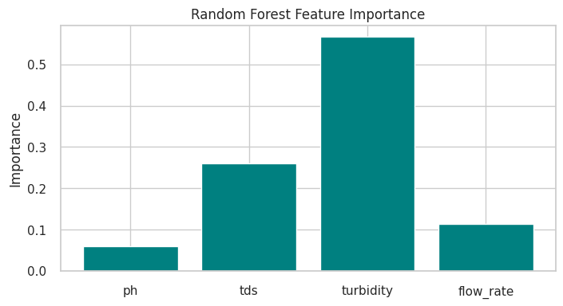
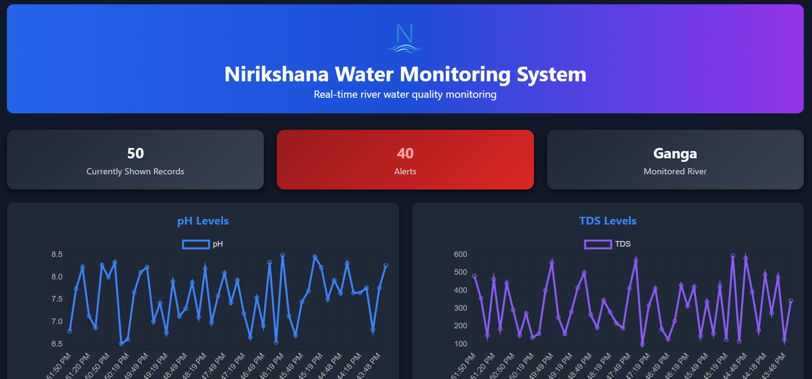
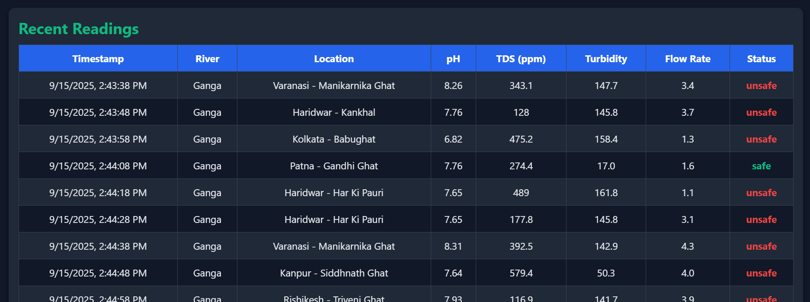

**Nirikshana End to End Water Monitoring System**

TO RUN, OPEN TERMINAL AND ENTER: 
1. python simulate_live.py
2. uvicorn app:app --reload
3. add /dashboard at the end of the link

Nirikshana utilises a robust hardware device to collect and wirelessly transmit water-quality data using numerous sensors (pH, turbidity, tds, water flow). 
The data is then sent to the backend where it is passed through an ML pipeline to predict water safety, and the finalised data is sent to an interative dashboard 
where one can see alerts, statistics and recently collected data to get an extensive overview. 

  

**Hardware**

Shell material: Plant-based bioplastic (WIP)

Energy system: Solar power (WIP)

Sensors: pH, Turbidity, TDS, Water flow

Prototype Brain: Arduino UNO

*Rough Sketches:*

  
  

*Hardware mock-up:*

  
  

 

**Machine Learning Model**

Currently Used: Random Forest with 'max_depth': None, 'min_samples_split': 2, 'n_estimators': 500 (Model .pkl file is available at *backend/models*)

Planned: XGBoost -> Custom deep learning pipeline

Originally trained synthetic data in Google Colab, then downloaded using joblib (Synthetic data .csv file is available at *backend/models*)

*Model performance metrics:*

  
  

 

**Backend**

FastAPI enables creation of multiple API endpoints, interacting with an SQLLite database to ensure a simple yet effective prototype design.

*seed.py* generates mock historic data, while *simulate_live.py* inputs live data at intervals to simulate the real pipeline.

 

**Dashboard**

Utilises HTML, CSS, Javascript, Chart.js to create an interactive viewer experience

  
  

